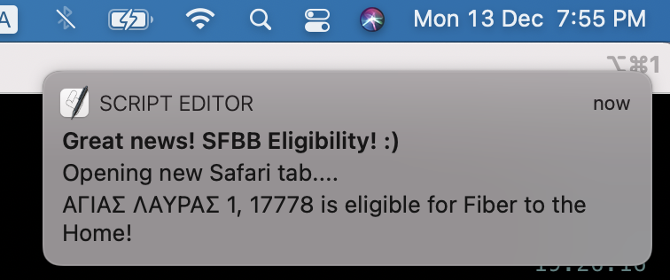
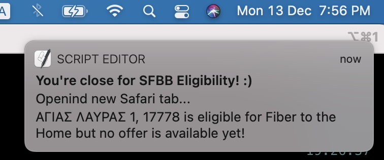
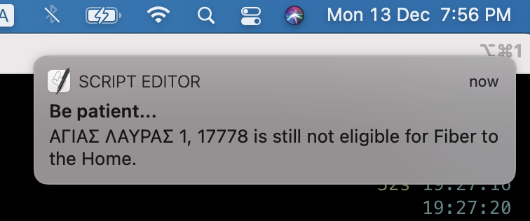
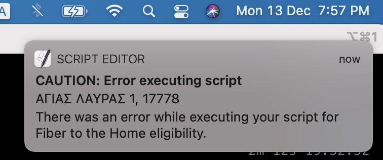

# SFBB Eligibility Check
## About
SFBB Eligibility Checker is a bash shell script that makes an HTTP request to [SFBB](https://submit.sfbb.gr/EligibilityCheck.aspx) and notifies you if your address is eligible to get a voucher for a SuperFast BroadBand connection.

## Prerequisites
* OS: MacOS
* JQ command must be installed (`brew install jq`)

## How to use
1. Download the project
2. Make the script executable with `chmod +x /your-path/SFBB_Eligibility_Checker.sh`
3. Do a trial run to check that the script works. For example `./FiberToHomeEligibility.sh 12344 'ΛΑΥΡΙΟΥ' 50 Monday` - If everything works you should see a notification on your Mac
4. Pick the script arguments that work for you:
    * 1st arg: The zip code of the address you are interested to
    * 2nd arg: The street
    * 3rd arg: The street number
    * 4th arg: The day when you want the script to notify you for "liveliness" (read more below)
5. Add a crontab so as to make the script run whenever you want.
    * `crontab -e` to edit your crontab
    * Add something like: `0 12 * * * bash -l /use/absolute/path/FiberToHomeEligibility.sh 12344 'ΛΑΥΡΙΟΥ' 50 Monday`
    * save and close
    * `crontab -l` to list your crontab
6. Repeat the previous step for as many addresses as you wish to check

## How it works
The script will do a POST HTTP request to `https://submit.sfbb.gr/EligibilityCheck.aspx?zip={{zipcode}}&address={{street}}`

The response will be an HTML document (yikes!)

The script will then check if one of the following are included in the response:
- `Στη διεύθυνση που δηλώσατε υπάρχουν διαθέσιμες προσφορές SFBB` (eligibility)
- `Η διεύθυνση που δηλώσατε περιλαμβάνεται στις περιοχές όπου θα προσφέρονται SFBB υπηρεσίες, αλλά ακόμη δεν υπάρχει καμία διαθέσιμη προσφορά.` (eligibility but no offer yet)
- `Στη διεύθυνση που δηλώσατε δεν υπάρχουν υποδομές ικανές να προσφέρουν SFBB υπηρεσίες.` (no eligibility)

If the address is eligible, the script will notify you right away with a success notification and open Safari at [SFBB](https://submit.sfbb.gr/EligibilityCheck.aspx)

If the address is not eligible, the script will notify you only once a week, and especially at the day that was specified by the 4th argument passed. This way you will avoid noisy notifications and the script will show its liveliness.

If something goes wrong, the script will notify with you with an error notification.

### Notification examples

